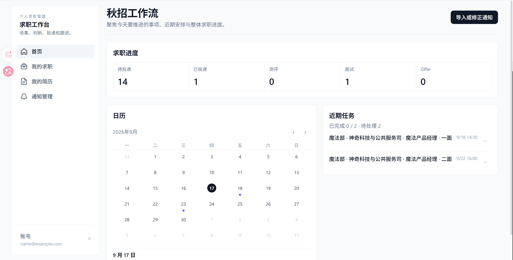
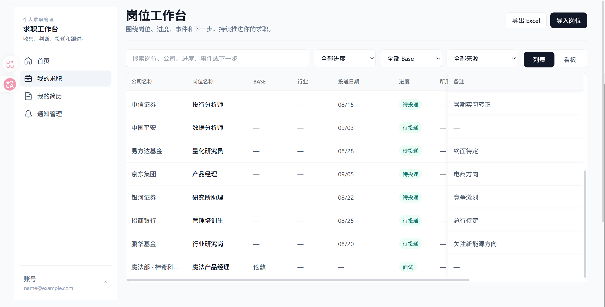
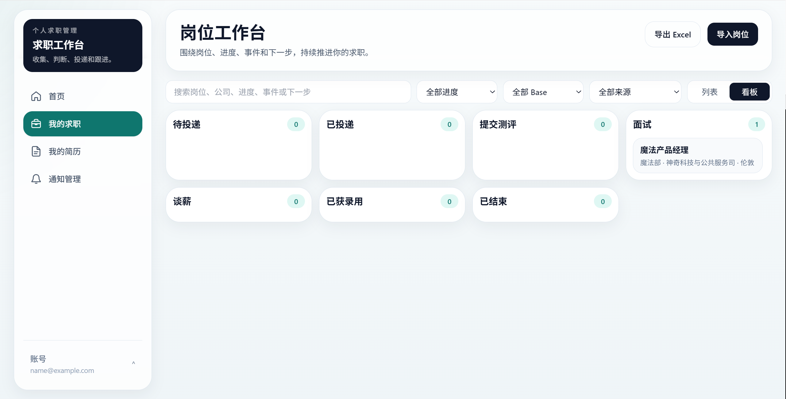
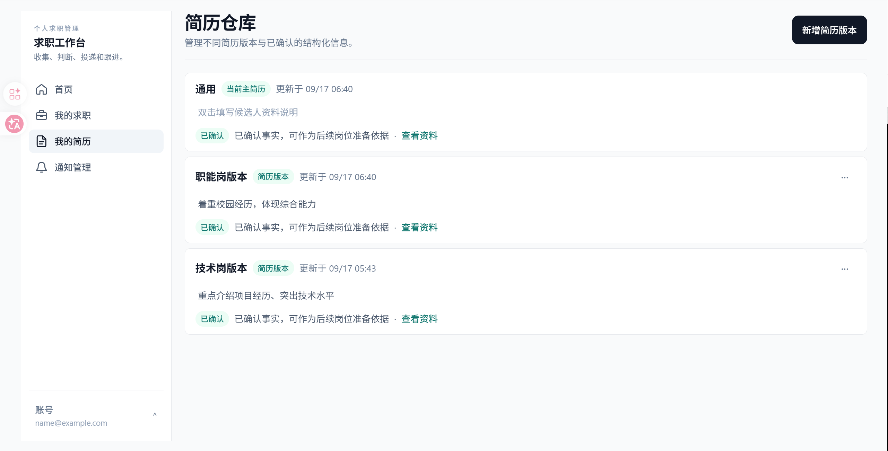
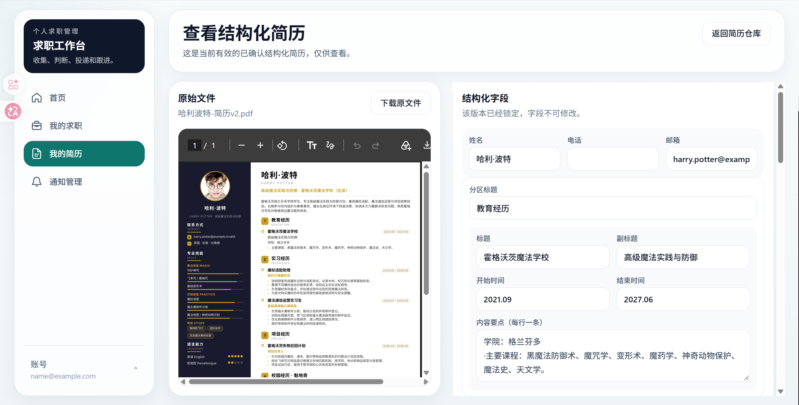
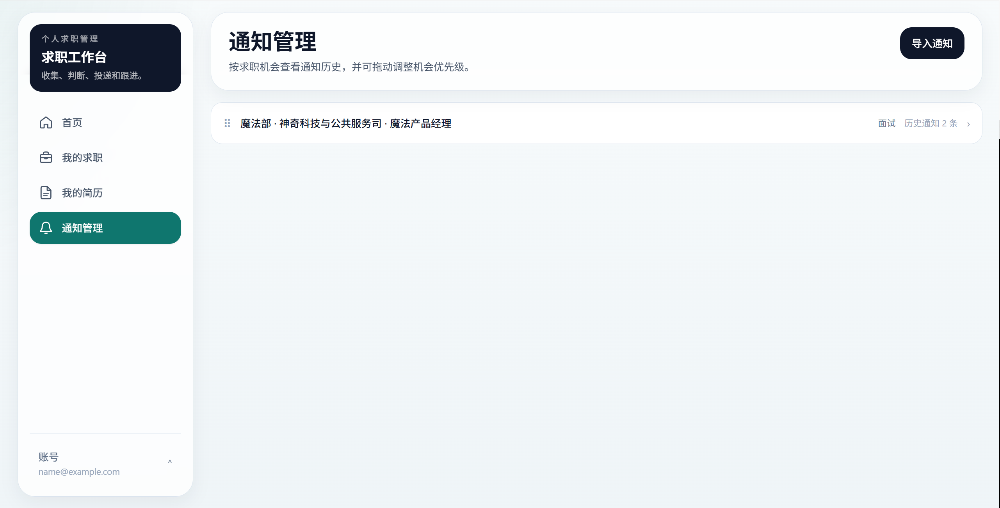
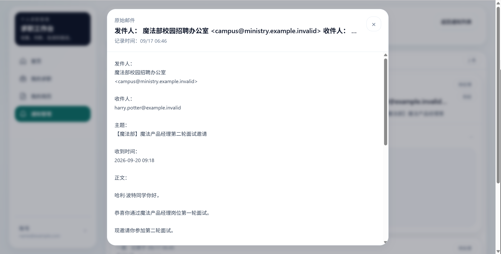

# 求职工作台

一个面向秋招 / 校招高频投递场景的个人求职管理工具。

把分散在招聘网站、邮件、聊天记录和本地文件里的信息整理到一个工作台中，集中管理：

**岗位 → 投递进度 → 招聘通知 → 面试 / 测评时间 → 简历版本 → 下一步事项**

## 在线体验

[立即使用求职工作台](https://project-iry1g.vercel.app/)

> 当前为个人 Beta 版本，适合用于秋招、校招和集中求职期间的岗位管理。

---

## 为什么做这个工具

秋招开始之后，真正麻烦的往往不是“找到一个岗位”，而是同时维护几十个机会：

- 这家公司投了吗？
- 投的是哪个岗位？
- 用了哪个简历版本？
- 测评什么时候截止？
- 下周有哪几场面试？
- 这封邮件对应哪个岗位？
- 这个岗位已经到一面还是二面了？
- 哪些事情今天必须处理？

当岗位数量变多，这些信息很容易散落在招聘网站、Excel、邮箱、聊天记录和脑子里。

求职工作台希望把这些信息重新整理成一条清晰的流程：

**记录岗位 → 跟踪进度 → 管理通知 → 安排近期事项 → 管理简历版本**

---

# 功能介绍

左侧导航目前包含四个主要工作区：

- 首页
- 我的求职
- 我的简历
- 通知管理

底部账号入口用于进入设置或退出登录。

---

## 1. 首页

首页用于快速回答两个问题：

**“我现在整体投到哪里了？”**

以及：

**“最近有什么事情必须处理？”**

首页主要包含：

### 求职进度

以横向统计的方式查看当前岗位分布，例如：

- 待投递
- 已投递
- 测评
- 面试
- Offer

适合快速了解目前整体求职进度。

### 日历

将招聘流程中的重要时间集中到月历中，例如：

- 笔试
- 测评
- AI 面
- 一面
- 二面
- 三面
- 截止时间

点击具体日期可以查看当天对应的招聘事件。

### 近期任务

集中显示近期需要处理的事项，并区分：

- 待处理
- 已完成

每条事件会尽量使用：

**公司 / 单位 + 岗位 + 事件类型**

的方式展示，避免把邮件发件人等无关信息带到首页。

<!-- 首页截图 -->


---

## 2. 我的求职

“我的求职”是整个工作台的岗位管理中心。

可以在这里：

- 导入新岗位
- 搜索岗位
- 按进度筛选
- 按 Base 筛选
- 按来源筛选
- 查看列表
- 查看看板
- 导出 Excel

### 列表模式

列表模式更接近传统的秋招投递台账，适合一次查看大量岗位。

目前会集中展示类似这些信息：

| 公司 | 岗位 | Base | 行业 | 开放日期 | 截止日期 | 投递日期 | 进度 | 所用简历 | 投递链接 | 来源 | 备注 |
| --- | --- | --- | --- | --- | --- | --- | --- | --- | --- | --- | --- |

没有数据的字段会保持为空，而不会用不可靠的信息进行推测。

表格支持横向滚动，因此即使字段较多，也可以保持较高的信息密度。

### 看板模式

如果更习惯按招聘阶段管理岗位，也可以切换到看板。

例如：

**待投递 → 已投递 → 测评 → 面试 → 谈薪 → 已获录用 → 已结束**

岗位卡片可以在不同阶段之间拖动。


### 岗位详情

点击岗位名称后，可以进一步查看该岗位的：

- JD
- 当前阶段
- 相关通知
- 事件时间线
- 下一步事项
- Agent 准备上下文

### 导出 Excel

岗位工作台中的记录可以导出为 Excel，方便：

- 本地备份
- 自己进一步整理
- 与传统求职台账结合使用

<!-- 我的求职截图 -->



---

## 3. 我的简历

“我的简历”进入的是 **简历仓库**。

它不是只保存一份简历，而是用于管理不同求职方向下的多个简历版本。

例如：

- 通用版
- 技术岗位版
- 产品岗位版
- 咨询岗位版

### 简历版本管理

可以新增新的简历版本，并查看：

- 简历名称
- 更新时间
- 简历说明
- 当前主简历
- 结构化信息确认状态

系统会保留多个版本，而不是用新上传的文件覆盖旧版本。

### 当前主简历

可以指定一份简历作为当前主简历。

主简历主要用于提供默认的候选人信息和后续岗位准备上下文。

历史版本仍然会保留在简历仓库中。

### 删除简历版本

不再需要的历史版本可以删除。

当前主简历受到保护，需要先切换主简历后再删除旧版本，避免误删当前正在使用的简历。

### 简历结构化

上传简历后，系统会将简历内容解析成结构化信息。

确认页面采用左右对照方式：

**左侧：原始简历**

**右侧：结构化字段**

这样可以直接对照原文检查：

- 教育经历
- 实习经历
- 项目经历
- 技能
- 其他候选人信息

确认后的信息可以作为后续岗位分析和 Agent 准备的候选人事实来源。

<!-- 简历仓库截图 -->


<!-- 简历结构化确认截图 -->


---

## 4. 通知管理

招聘流程中的大量变化实际上来自通知：

- 测评邀请
- 笔试通知
- AI 面
- 一面
- 二面
- 三面
- Offer
- 拒绝通知
- 截止时间提醒

“通知管理”用于把这些信息与具体岗位关联起来。

### 导入通知

收到招聘邮件或其他通知后，可以将内容导入系统。

系统会尝试识别：

- 对应公司
- 对应岗位
- 通知类型
- 面试时间
- 测评时间
- 截止时间
- 收到通知的时间

然后将它加入对应岗位的通知历史。

### 按岗位管理通知

通知不是简单地按公司堆在一起，而是按照：

**公司 + 岗位**

进行管理。

因此同一家公司的多个岗位不会混成一条记录。

### 通知历史

进入某个岗位后，可以查看完整通知时间线。

事件可以按照状态区分：

- 待处理
- 已完成
- 已忽略

通知状态会与首页近期任务同步。

### 原始邮件

结构化信息用于快速查看和安排任务。

如果需要核对原始内容，也可以查看完整邮件正文。

这样既避免长邮件占据大量页面空间，又能随时回到原始通知确认细节。

<!-- 通知管理截图 -->


<!-- 通知详情截图 -->


---

# 一个典型使用流程

例如，你准备投递一家公司的产品岗位：

### 1. 导入岗位

进入：

**我的求职 → 导入岗位**

记录：

- 公司
- 岗位
- Base
- JD
- 来源
- 投递链接

### 2. 更新投递状态

投递完成后，将岗位从：

**待投递**

更新为：

**已投递**

之后可以继续更新到：

**测评 → 面试 → Offer**

### 3. 收到招聘通知

收到测评或面试邮件后，进入：

**通知管理**

导入通知，并关联到对应岗位。

### 4. 查看近期安排

回到首页。

面试、笔试和截止时间会集中出现在：

- 日历
- 近期任务

中。

### 5. 管理简历版本

如果不同岗位使用不同简历，可以在：

**我的简历 → 简历仓库**

中维护多个版本。

---

# 推荐使用方式

### 每天开始求职前

先看首页：

- 最近有哪些任务
- 今天有没有面试
- 有没有快到期的测评

### 集中投递时

进入“我的求职”：

- 搜索岗位
- 更新进度
- 批量查看岗位
- 使用看板调整阶段

### 收到招聘邮件后

进入“通知管理”：

- 导入通知
- 检查岗位关联
- 检查面试 / 测评时间
- 完成后更新事件状态

### 修改简历时

进入“我的简历”：

- 新增一个简历版本
- 校对结构化信息
- 根据需要切换当前主简历

---

# 当前版本边界

目前仍然是个人 Beta 版本。

当前主要边界包括：

- 招聘通知目前主要通过手动导入，尚未自动连接邮箱。
- AI / Agent 能力主要负责辅助分析和准备，不会自动替用户完成投递。
- 重要的面试时间、笔试时间和 deadline，仍建议以招聘方原始通知为最终依据。
- 部分岗位字段只有在用户或 JD 提供明确数据时才会展示，不会自动猜测。

---

# 示例数据

为了方便公开展示，仓库截图可以使用完全虚构的 Demo 数据。

例如：

- 霍格沃茨魔法学校
- 魔法部
- 古灵阁
- 魔法产品经理
- 哈利·波特

这些内容仅用于展示产品流程，不对应任何真实个人、公司或招聘信息。

---

# 隐私

- 每个账号的数据相互隔离。
- 简历文件不会公开展示给其他普通用户。
- 求职记录、通知和候选人资料仅用于当前账号自己的工作流。
- 公开 GitHub 截图建议使用虚构 Demo 数据，不上传真实求职邮件或个人隐私。

---

# 开发者信息

<details>

<summary>技术栈与本地运行</summary>

## 技术栈

- Next.js
- React
- TypeScript
- Prisma
- PostgreSQL / Neon
- Vercel
- Vercel Blob

## 本地运行

```bash
npm install
npm run dev
```

运行前需要配置项目所需的环境变量。

## 构建

```bash
npm run build
```

## PostgreSQL Migration

生产或 Preview 环境部署数据库迁移时，应显式指定目标 PostgreSQL 数据库。

```bash
npm run prisma:generate:postgres
npm run prisma:migrate:status:postgres
npm run prisma:migrate:deploy:postgres
npm run prisma:migrate:status:postgres
```

不要使用 `prisma migrate dev` 或 `prisma db push` 作为正式发布步骤。

更多部署信息请查看：

- `DEPLOYMENT.md`
- `OPS_LAUNCH_AND_DOMAIN_CUTOVER.md`

</details>
