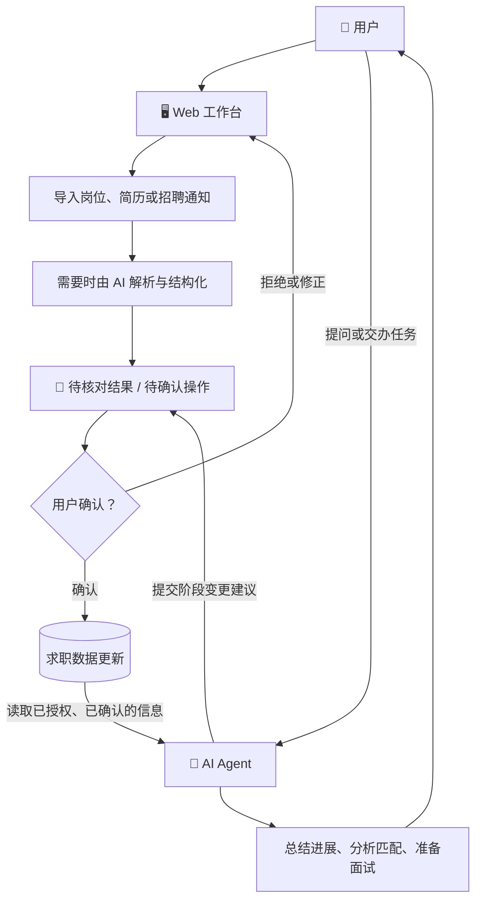

# 🚀 Job Hunt AI Workbench

> **把分散的岗位、简历和招聘通知，整理成一条清晰、可跟进、可与 AI 协作的求职流程。**

Job Hunt AI Workbench 是一个面向求职者的智能求职工作台。它用 Web 应用管理真实的求职记录，再让 AI Agent 基于这些已确认的信息进行查询、总结、准备和状态同步建议。

你负责判断和确认，AI 负责整理与辅助。日常解析与推荐的 Agent 协作路径都保留了人工核对环节。

| 你可以用它做什么 | 带来的价值 |
| --- | --- |
| 📋 统一管理岗位与投递 | 随时知道每个机会进展到哪一步 |
| 📩 解析招聘通知 | 从长邮件中提取时间、地点、链接和行动项 |
| 📄 管理简历版本 | 记录每次申请实际使用的简历 |
| 📅 汇总日历与待办 | 集中查看近期面试、测评和截止时间 |
| 🤖 与 AI Agent 协作 | 用可信上下文完成总结、匹配分析和准备工作 |

---

## 🎯 它解决什么问题？

求职过程中，信息通常散落在招聘平台、邮件、聊天记录、本地文件和个人表格里。岗位一多，几个问题会反复出现：

- 这份岗位是否已经投递？当前处于测评、一面还是等待反馈？
- 收到的通知里，具体时间、有效期、会议链接和要求是什么？
- 这次申请使用的是哪一版简历？内容是否已经核对？
- 今天有什么必须处理的事项？接下来应该先推进哪个岗位？
- 准备面试时，怎样把 JD、简历和历史通知快速交给 AI？

传统方式需要不断复制、整理和同步。Job Hunt AI Workbench 把这些信息连接成一条持续更新的记录：

```text
保存岗位 → 关联简历 → 跟踪阶段 → 导入通知 → 安排下一步 → 让 Agent 基于事实协作
```

---

## ✨ 核心功能

### 1. 📋 求职信息管理

#### 用户如何操作

1. 进入「我的求职」，点击「导入岗位」。
2. 粘贴 JD 正文或岗位截图；已有表格时，也可以批量导入 `.xlsx`。
3. 单条导入时，系统识别公司、岗位、职责、要求等信息并生成岗位卡片。
4. 核对识别结果，补充来源、城市、行业、薪资范围等字段后保存。
5. 在表格或看板中持续更新投递阶段、渠道、备注和下一步行动。

#### 你会得到

- **完整岗位档案**：JD、职责、要求、来源链接与导入原文集中保存。
- **清晰阶段追踪**：覆盖待投递、已投递、测评、笔试、多轮面试、谈薪、Offer、拒绝和关闭等状态。
- **表格 + 看板视图**：支持关键词、阶段、城市和来源筛选，也可拖动卡片更新进度。
- **批量迁移能力**：可从 Excel 导入已有记录，也可将岗位列表导出为 Excel。
- **申请上下文**：为每个岗位记录所用简历、投递渠道、推进备注和历史事件。

---

### 2. 📄 简历版本与候选人资料

#### 用户如何操作

1. 进入「我的简历」，点击「新增简历版本」。
2. 上传文本、PDF、Word 或图片文件；同一版本可同时上传多个文件。
3. 系统提取结构化候选人资料。
4. 对照原文件检查教育、经历、项目、技能等字段，修正后确认。
5. 将可信版本设为主简历，或关联到某一个具体岗位。

#### 你会得到

- 一个不会互相覆盖的**简历版本库**。
- 每次申请与实际使用简历之间的明确关联。
- 经过人工核对的结构化候选人资料。
- 可供 Agent 使用的可信简历上下文。

> 只有用户确认后的结构化简历，才会通过推荐的 Agent 读取能力作为候选人事实提供；未确认内容不会被当作可靠信息。

---

### 3. 📩 招聘通知智能处理

适用于笔试通知、在线测评、AI 面试、多轮面试、Offer、拒绝通知和截止提醒等内容。

#### 用户如何操作

1. 进入「通知管理」，点击「导入通知」。
2. 选择通知对应的岗位。
3. 粘贴邮件或消息正文，并可选填写主题、发件人和接收时间。
4. AI 解析通知内容，生成一条待确认结果。
5. 检查识别内容，点击「确认通知信息」后写入招聘时间线。

#### AI 会整理什么

| 信息 | 示例 |
| --- | --- |
| 通知类型 | 笔试、测评、一面、二面、截止提醒 |
| 时间安排 | 固定时间、有效时间窗口、截止时间 |
| 参与方式 | 线上、线下或混合形式 |
| 关键入口 | 会议链接、测试链接或线下地点 |
| 要求事项 | 材料准备、设备要求、确认方式 |
| 后续动作 | 回复确认、完成测评、准备作品材料 |

系统同时保留通知原文和关键原文摘录。用户可以对照证据检查解析结果，而不是只能接受一段无法追溯的 AI 总结。

> 当前版本需要用户手动粘贴通知内容，**不会连接或自动读取邮箱**。

---

### 4. 📅 时间线、日历与今日待办

每个岗位都有自己的招聘时间线，通知可以被标记为**待处理、已完成或已忽略**，也可以修正内容或重新关联岗位。

首页进一步把所有岗位的关键信息汇总在一起：

- 查看待投递、已投递、测评、面试和 Offer 数量。
- 在日历中查看面试、测评、笔试和截止时间。
- 集中处理今天需要关注的事项。
- 从全局进度快速回到具体岗位和通知记录。

这样既能看到「ABC 科技有限公司 · 技术产品岗位」的完整历史，也能从全局判断今天最应该先处理什么。

---

## 🤖 Web + AI Agent 如何协作

Web 工作台负责保存和确认事实，Agent 负责读取上下文、整理信息并提出建议。两者共享同一套求职记录，但承担不同角色。


```mermaid
flowchart TD
    U[👤 用户] --> W[🖥️ Web 工作台]
    W --> I[导入岗位、简历或招聘通知]
    I --> P[需要时由 AI 解析与结构化]
    P --> R[📌 待核对结果 / 待确认操作]
    R --> C{用户确认？}
    C -->|确认| D[(求职数据更新)]
    C -->|拒绝或修正| W

    D -->|读取已授权、已确认的信息| A[🤖 AI Agent]
    U -->|提问或交办任务| A
    A --> S[总结进展、分析匹配、准备面试]
    S --> U
    A -->|提交阶段变更建议| R
```

### 两种协作方式

| 使用方式 | 适合谁 | 如何使用 |
| --- | --- | --- |
| **复制 AI 上下文** | 想立即使用任意对话式 AI 的用户 | 在岗位详情中选择任务，复制 Markdown、JSON 或完整 Prompt |
| **连接自己的 Agent** | 希望让 Agent 按需查询和同步进度的用户 | 生成个人 Token，通过远程 MCP 连接工作台 |

复制上下文时，可以直接选择「准备笔试」「准备面试」「深挖项目」「分析岗位匹配」或「面试复盘」。系统会组合当前岗位、投递状态、历史通知和已确认简历，减少重复粘贴。

连接 Agent 后，可以这样提问：

> 帮我总结最近的求职进展，并列出未来 7 天的截止事项。

> 基于已确认的简历和 JD，帮我准备 ABC 科技有限公司产品经理岗位的一面。

> XYZ 企业的软件工程岗位已经进入面试阶段，请帮我提交状态更新建议。

### Human-in-the-loop：重要修改由用户决定

在推荐的 MCP 协作流程中，Agent 提议修改申请阶段时，不会直接覆盖网站中的核心记录：

```text
Agent 提交建议
      ↓
网站生成待确认事项
      ↓
用户查看变化与建议来源
      ↓
确认并执行 / 拒绝
```

用户始终保留最终决定权。已拒绝或已关闭的申请，也不会通过这条建议流程被继续推进。

---

## 🧠 AI 可以辅助哪些工作？

| 工作场景 | Agent 使用的上下文 | 可以得到的结果 |
| --- | --- | --- |
| 📊 进度总结 | 岗位、阶段、下一步、历史事件 | 当前进展、停滞项与待办清单 |
| ⏰ 截止提醒 | 今日事件、未来截止时间 | 按时间排序的行动建议 |
| 🎯 岗位匹配 | JD + 已确认简历 | 匹配项、差距和准备重点 |
| 🎤 面试准备 | 岗位、简历、通知要求 | 自我介绍思路、问题清单、项目准备方向 |
| 🔄 状态同步 | 当前阶段 + 用户指令 | 一条可审查、可拒绝的阶段变更建议 |

AI 输出用于辅助整理和决策，不替代用户对岗位、时间和个人经历的核对。

---

## 📝 从零开始使用

1. **注册并登录**：建立只属于当前账户的求职空间。
2. **导入岗位**：粘贴 JD、截图，或从 Excel 批量迁移已有记录。
3. **上传简历**：检查结构化结果，确认后设置主简历或关联具体申请。
4. **持续更新进度**：使用表格、看板、岗位详情和通知时间线维护事实。
5. **导入招聘通知**：让 AI 提取节点，确认后进入日历与待办。
6. **按需使用 Agent**：直接复制上下文，或配置 MCP 连接进行持续协作。

---

## ⚙️ 配置方式

### 普通用户

站点管理员配置了默认 AI 服务时，可以直接使用。也可以在「账户中心 → AI 模型设置」中填写自己的 OpenAI-compatible 服务、文本模型和视觉模型；个人配置只作用于自己的账户。

### 连接 AI Agent

1. 打开「账户中心 → Agent 接入」。
2. 创建一个按用途命名的 API Token，并立即保存一次性显示的明文。
3. 在支持远程 MCP 和自定义请求头的客户端中填写：

```text
Server URL: https://<你的部署域名>/api/mcp
Authorization: Bearer <YOUR_API_TOKEN>
```

4. 先让 Agent 执行只读查询，确认连接和账户隔离正常。

> Token 相当于账户数据访问凭证，只应交给受信任的客户端。怀疑泄漏时，请立即在账户中心撤销。项目还提供面向高级自动化的 Agent API；部分 API 支持直接写入，因此不等同于 MCP 的待确认流程。

### 本地运行

准备 Node.js、npm 和 PostgreSQL，在仓库根目录创建 `.env`：

```dotenv
DATABASE_URL="postgresql://<user>:<password>@<host>:<port>/<database>"
APP_URL="http://localhost:3000"
STORAGE_PROVIDER="local"

# 岗位、通知和图片解析所需
OPENAI_API_KEY="<your-api-key>"
OPENAI_MODEL="<text-model>"
OPENAI_VISION_MODEL="<vision-model>"
```

然后执行：

```bash
npm install
npm run prisma:generate:postgres
npm run prisma:migrate:deploy:postgres
npm run dev
```

打开 `http://localhost:3000`，注册账户后即可开始使用。生产环境需要使用持久化数据库、HTTPS 地址和持久化文件存储。

---

## 🔒 当前能力边界

- 不会自动登录招聘网站，也不会代替用户投递岗位。
- 不会连接或自动读取个人邮箱，通知需要手动粘贴。
- AI 解析结果需要用户核对；通知在确认后才写入时间线。
- 未确认的结构化简历不会通过推荐的 Agent 读取能力作为候选人事实返回。
- MCP 提出的阶段变更需要用户确认，不能静默生效。
- 面试准备、匹配分析和行动建议仍需要用户判断，不应被视为确定事实。

---

## 🛠 技术实现

项目使用 **Next.js + React** 构建 Web 界面，以 **PostgreSQL + Prisma** 管理数据，通过可配置的 **AI API** 完成文本与图片解析，并提供 **MCP Server**、Agent API 和 Webhook 与外部 Agent 或自动化工作流协作。

技术能力服务于一个简单原则：**AI 可以提高整理和准备效率，但真实求职数据应当可追溯、可核对，并由用户掌控。**
